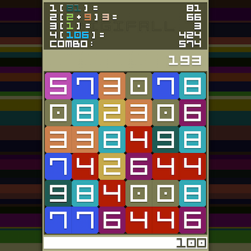
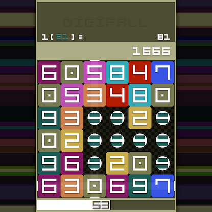

`work in progress`

# [DIGIFALL](https://digifall.app)

> Entropy fighting mathematactic game

A deterministic survival puzzle game begins with a reserve of 100 energy points. Each move, which increment a card's value by one, consumes 10 points from this reserve. Adjacent cards with identical values merge to form a cluster, when a cards values matches the cluster's size, the cluster is eliminated, replenishing your energy by an amount equal to the cards values. The player's objective is to survive as long as possible while accumulating the highest score achievable. The game features a decentralized leaderboard with 81 slots, allowing you to immortalize your string name. The integrity of game records is ensured through validation mechanisms implemented directly on each game client.

