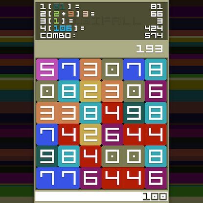
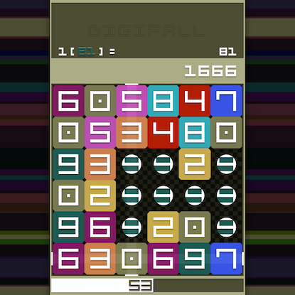

# [DIGIFALL](https://digifall.app)

[](https://play.google.com/store/apps/details?id=com.llblab.digifall "Get it on Google Play")

> Entropy fighting mathematactic game

A deterministic survival puzzle game begins with a reserve of 100 energy points. Each move, which increment a card's value by one, consumes 10 points from this reserve. Adjacent cards with identical values merge to form a cluster, when a cards values matches the cluster's size, the cluster is eliminated, replenishing your energy by an amount equal to the cards values. The player's objective is to survive as long as possible while accumulating the highest score achievable. The game features a decentralized leaderboard with 1000 slots, allowing you to immortalize your string name. The integrity of game records is ensured through validation mechanisms implemented directly on each game client.

[](https://digifall.app "https://digifall.app")[](https://digifall.app "https://digifall.app")

# Architecture

- `Immortal Software`: A protocol-as-game designed to survive without central servers
- `Deterministic Core`: All game logic is seeded and reproducible
- `Trustless P2P`: Leaderboard data synchronizes via libp2p relays
- `Domain DAG`: `domain-dag.json` records the intended dependency layers and boundary checks; the validator skill is vendored in `.agents/skills/domain-dag`

## Experimental on-chain protocol

A standalone `no_std` FRAME pallet is under active development in [`chain/`](chain/README.md). It owns bounded current game state, stake custody, scheduled chain randomness, delegated session control, and reward settlement without changing the existing web client. See the [protocol contract and production gates](docs/on-chain-pallet.md).

# Project Control

- [Agent protocol](AGENTS.md)
- [Backlog](BACKLOG.md)
- [Changelog](CHANGELOG.md)
- [Docs index](docs/README.md)

# Server Nodes

## Prerequisites

- A server running Linux (Debian/Ubuntu or RHEL/CentOS/Fedora)
- Root access to the server
- A domain name pointing to your server (for SSL certificate)
- Node.js v22+ with npm

## Relay Node

Circuit relay for NAT traversal, enabling browser peers to connect.

```bash
curl -fsSL https://raw.githubusercontent.com/llblab/digifall/main/scripts/deploy-relay.sh -o deploy-relay.sh
chmod +x deploy-relay.sh
sudo ./deploy-relay.sh
```

To remove the relay:

```bash
curl -fsSL https://raw.githubusercontent.com/llblab/digifall/main/scripts/undeploy-relay.sh -o undeploy-relay.sh
chmod +x undeploy-relay.sh
sudo ./undeploy-relay.sh
```

## Leaderboard Node

Headless leaderboard peer for network bootstrapping and data persistence.

```bash
git clone https://github.com/llblab/digifall.git
cd digifall
npm install
npm run leaderboard
```

Custom relays via environment variable:

```bash
DIGIFALL_RELAYS="/dns4/your.relay/tcp/443/wss/p2p/12D3KooW..." npm run leaderboard
```
